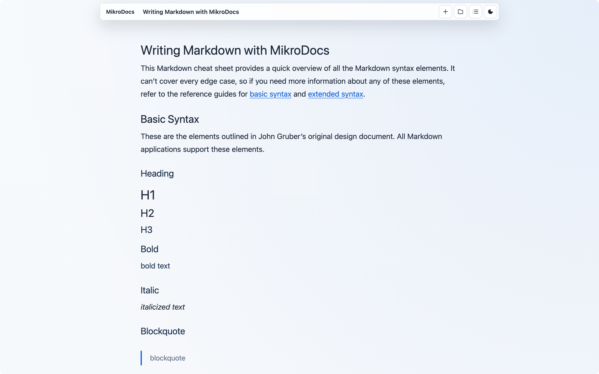

# MikroDocs

**MikroDocs is a minimalist, local-first writing app for Markdown documents.**



Use MikroDocs online for free at [docs.mikrosuite.com](https://docs.mikrosuite.com). It runs directly in the browser over HTTPS, needs no account, and stores documents privately in browser storage for that site unless you export them.

MikroDocs is an ultra-minimal, local-first writing app for modern browsers. It gives you a fast markdown editor, document library, import/export tools, and browser-local storage without sending your documents anywhere.

## Why MikroDocs

- **Own the writing**: documents, settings, and history stay in browser-local storage unless you export them.
- **Keep the surface calm**: write, preview, organize, search, and export without account or workspace ceremony.
- **Use open files**: Markdown, ZIP backups, and DOCX import/export keep documents portable.
- **Deploy simply**: the app is static HTML, CSS, and JavaScript with optional native host support.

## Features

- **Local-first documents** stored in browser IndexedDB
- **Markdown writing experience** with a focused editor and pretty rendered overlay
- **Document library** with search, duplicate, delete, import, and backup flows
- **Outline, tags, stable document links, and backlinks** for navigating local documents
- **Command palette** for fast document actions
- **Formatting toolbar** for headings, lists, checklist, quote, links, code, dividers, tables, and images
- **Find and replace** inside the active document
- **Version history** with snapshot preview and restore
- **Writing settings** for theme, font family, scale, autosave, and source mode
- **Storage and backup health** with persistent-storage requests, image summaries, backup reminders, and all-Markdown ZIP export
- **Offline app shell** through a static service worker
- **Expanded Markdown support** for frontmatter, duplicate-safe heading anchors, table of contents, footnotes, callouts, math, strikethrough, and Mermaid source blocks
- **DOCX and Markdown import/export support** through the browser file gateway
- **Static deployment** for any host that can serve HTML, CSS, and JavaScript

## Quick Start

Open [docs.mikrosuite.com](https://docs.mikrosuite.com) to use MikroDocs immediately, securely, and without an account.

### Download the App

```bash
curl -sSL -o mikrodocs.zip https://releases.mikrosuite.com/mikrodocs_latest.zip
unzip mikrodocs.zip -d mikrodocs
```

Serve the extracted files with any static web server. For a quick local check:

```bash
cd mikrodocs/*
npx http-server . -a 127.0.0.1 -p 8000 -c-1
```

Open `http://127.0.0.1:8000`.

## Runtime Configuration

MikroDocs is a static local-first app. It does not need server configuration, API credentials, or runtime secrets. Documents, settings, and history are stored in IndexedDB for the current browser profile and origin.

Browser deployments use download-based import and export. Native shells can add file-system integration by injecting the optional Tauri gateway.

## Release Downloads

Latest release download:

- `https://releases.mikrosuite.com/mikrodocs_latest.zip`

GitHub Releases provide versioned archives for pinned deployments.

## Technology

- **Frontend**: Vanilla HTML, CSS, and TypeScript compiled with esbuild
- **Storage**: IndexedDB for browser-local documents
- **Documents**: Markdown rendering plus DOCX import/export service support
- **Build**: Prebuilt static release archive

## License

MIT.
